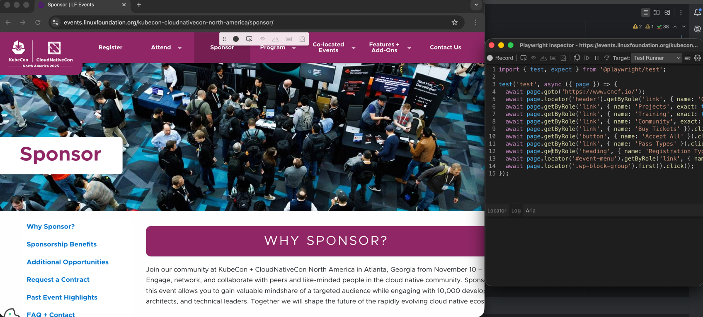

import LiteYouTube from '@site/src/components/LiteYouTube';

## Introduction

* Playwright
  * allows
    * generating tests for you -- based on -- performed actions | browser /
      * figure out the best locator -- following -- the priority [role, text and test id locators](Guides/Locators/locators.md) /
        * if there are MULTIPLE elements / match the locator -> it improves the locator / UNIQUELY identify the target element
      * ALLOWED
        * actions
          * _Example:_ click OR fill
        * assertions
          * -- via -- click 1 toolbar's icon & click | element
          * are
            * `'assert visibility'`
              * == element is visible
            * `'assert text'`
              * == element contains specific text
            * `'assert value'`
              * == element has a specific value

## Generate tests in VS Code
* TODO:
* langs: js

Install the VS Code extension and generate tests directly from VS Code
* The extension is available on the [VS Code Marketplace](https://marketplace.visualstudio.com/items?itemName=ms-playwright.playwright)
* Check out our guide on [getting started with VS Code](./getting-started-vscode.md).

<LiteYouTube
    id="LM4yqrOzmFE"
    title="Generating Playwright tests in VS Code"
/>

### Record a New Test

To record a test click on the **Record new** button from the Testing sidebar. This will create a `test-1.spec.ts` file as well as open up a browser window.


In the browser go to the URL you wish to test and start clicking around to record your user actions.


Playwright will record your actions and generate the test code directly in VS Code. You can also generate assertions by choosing one of the icons in the toolbar and then clicking on an element on the page to assert against. The following assertions can be generated:
  * `'assert visibility'` to assert that an element is visible
  * `'assert text'` to assert that an element contains specific text
  * `'assert value'` to assert that an element has a specific value


Once you are done recording click the **cancel** button or close the browser window. You can then inspect your `test-1.spec.ts` file and manually improve it if needed.


### Record at Cursor

To record from a specific point in your test move your cursor to where you want to record more actions and then click the **Record at cursor** button from the Testing sidebar. If your browser window is not already open then first run the test with 'Show browser' checked and then click the **Record at cursor** button.


In the browser window start performing the actions you want to record.


In the test file in VS Code you will see your new generated actions added to your test at the cursor position.


### Generating locators

You can generate locators with the test generator.
- Click on the **Pick locator** button form the testing sidebar and then hover over elements in the browser window to see the [locator](Guides/Locators/locators.md) highlighted underneath each element.
- Click the element you require and it will now show up in the **Pick locator** box in VS Code.
- Press <kbd>Enter</kbd> on your keyboard to copy the locator into the clipboard and then paste anywhere in your code. Or press 'escape' if you want to cancel.


## Generate tests with the Playwright Inspector

* `codegen` command
  * 2 windows are opened
    * browser window | you interact -- with the -- website
    * Playwright Inspector window | you can
      * record your tests
      * copy the tests | your editor

* `.. playwright codegen websiteURLWhereGenerateTests`
  * `websiteURLWhereGenerateTests`
    * OPTIONAL
      * if you do NOT specify it -> | opened browser window, specify it

  * ways
    ```bash js
    npx playwright codegen demo.playwright.dev/todomvc
    ```

    ```bash java
    mvn exec:java -e -D exec.mainClass=com.microsoft.playwright.CLI -D exec.args="codegen demo.playwright.dev/todomvc"
    ```

    ```bash python
    playwright codegen demo.playwright.dev/todomvc
    ```

    ```bash csharp
    pwsh bin/Debug/netX/playwright.ps1 codegen demo.playwright.dev/todomvc
    ```
* record a test
  * perform actions | browser window
  * stop the recording & press the **copy** button

* _Example:_ `npx playwright codegen https://www.cncf.io/`
  

### Generating locators

* steps
  * stop the recording
  * select the `'Pick Locator'`
  * select elements | browser window
    * -> | Playwright inspector window,
      * highlight EACH element

* _Example:_ `npx playwright codegen https://www.cncf.io/`

## Emulation

You can use the test generator to generate tests using emulation so as to generate a test for a specific viewport, device, color scheme, as well as emulate the geolocation, language or timezone. The test generator can also generate a test while preserving authenticated state.

### Emulate viewport size

Playwright opens a browser window with its viewport set to a specific width and height and is not responsive as tests need to be run under the same conditions. Use the `--viewport` option to generate tests with a different viewport size.

```bash js
npx playwright codegen --viewport-size=800,600 playwright.dev
```

```bash java
mvn exec:java -e -D exec.mainClass=com.microsoft.playwright.CLI -D exec.args="codegen --viewport-size=800,600 playwright.dev"
```

```bash python
playwright codegen --viewport-size=800,600 playwright.dev
```

```bash csharp
pwsh bin/Debug/netX/playwright.ps1 codegen --viewport-size=800,600 playwright.dev
```
######
* langs: js


######
* langs: java


######
* langs: python


######
* langs: csharp


### Emulate devices

Record scripts and tests while emulating a mobile device using the `--device` option which sets the viewport size and user agent among others.

```bash js
npx playwright codegen --device="iPhone 13" playwright.dev
```

```bash java
mvn exec:java -e -D exec.mainClass=com.microsoft.playwright.CLI -D exec.args='codegen --device="iPhone 13" playwright.dev'
```

```bash python
playwright codegen --device="iPhone 13" playwright.dev
```

```bash csharp
pwsh bin/Debug/netX/playwright.ps1 codegen --device="iPhone 13" playwright.dev
```
######
* langs: js


######
* langs: java


######
* langs: python


######
* langs: csharp


### Emulate color scheme

Record scripts and tests while emulating the color scheme with the `--color-scheme` option.

```bash js
npx playwright codegen --color-scheme=dark playwright.dev
```

```bash java
mvn exec:java -e -D exec.mainClass=com.microsoft.playwright.CLI -D exec.args="codegen --color-scheme=dark playwright.dev"
```

```bash python
playwright codegen --color-scheme=dark playwright.dev
```

```bash csharp
pwsh bin/Debug/netX/playwright.ps1 codegen --color-scheme=dark playwright.dev
```

######
* langs: js


######
* langs: java


######
* langs: python


######
* langs: csharp


### Emulate geolocation, language and timezone

Record scripts and tests while emulating timezone, language & location using the `--timezone`, `--geolocation` and `--lang` options. Once the page opens:

1. Accept the cookies
1. On the top right click on the locate me button to see geolocation in action.

```bash js
npx playwright codegen --timezone="Europe/Rome" --geolocation="41.890221,12.492348" --lang="it-IT" bing.com/maps
```

```bash java
mvn exec:java -e -D exec.mainClass=com.microsoft.playwright.CLI -D exec.args='codegen --timezone="Europe/Rome" --geolocation="41.890221,12.492348" --lang="it-IT" bing.com/maps'
```

```bash python
playwright codegen --timezone="Europe/Rome" --geolocation="41.890221,12.492348" --lang="it-IT" bing.com/maps
```

```bash csharp
pwsh bin/Debug/netX/playwright.ps1 codegen --timezone="Europe/Rome" --geolocation="41.890221,12.492348" --lang="it-IT" bing.com/maps
```

######
* langs: js


######
* langs: java


######
* langs: python


######
* langs: csharp


### Preserve authenticated state

Run `codegen` with `--save-storage` to save [cookies](https://developer.mozilla.org/en-US/docs/Web/HTTP/Cookies) and [localStorage](https://developer.mozilla.org/en-US/docs/Web/API/Window/localStorage) at the end of the session. This is useful to separately record an authentication step and reuse it later when recording more tests.

```bash js
npx playwright codegen github.com/microsoft/playwright --save-storage=auth.json
```

```bash java
mvn exec:java -e -D exec.mainClass=com.microsoft.playwright.CLI -D exec.args="codegen github.com/microsoft/playwright  --save-storage=auth.json"
```

```bash python
playwright codegen github.com/microsoft/playwright --save-storage=auth.json
```

```bash csharp
pwsh bin/Debug/netX/playwright.ps1 codegen github.com/microsoft/playwright --save-storage=auth.json
```

######
* langs: js


######
* langs: java


######
* langs: python


######
* langs: csharp


#### Login

After performing authentication and closing the browser, `auth.json` will contain the storage state which you can then reuse in your tests.


Make sure you only use the `auth.json` locally as it contains sensitive information. Add it to your `.gitignore` or delete it once you have finished generating your tests.

#### Load authenticated state

Run with `--load-storage` to consume the previously loaded storage from the `auth.json`. This way, all [cookies](https://developer.mozilla.org/en-US/docs/Web/HTTP/Cookies) and [localStorage](https://developer.mozilla.org/en-US/docs/Web/API/Window/localStorage) will be restored, bringing most web apps to the authenticated state without the need to login again. This means you can can continue generating tests from the logged in state.

```bash js
npx playwright codegen --load-storage=auth.json github.com/microsoft/playwright
```

```bash java
mvn exec:java -e -D exec.mainClass=com.microsoft.playwright.CLI -D exec.args="codegen --load-storage=auth.json github.com/microsoft/playwright"
```

```bash python
playwright codegen --load-storage=auth.json github.com/microsoft/playwright
```

```bash csharp
pwsh bin/Debug/netX/playwright.ps1 codegen --load-storage=auth.json github.com/microsoft/playwright
```

######
* langs: js


######
* langs: java


######
* langs: python


######
* langs: csharp


## Record using custom setup

* steps
  * [record -- via -- Codegen](#generate-tests-with-the-playwright-inspector)
  * | generated code,
    * add your DESIRED custom setup
      * _Example:_ `BrowserContext.route`, `Page.pause`

