* goal
  * Playwright VS Code extension
    * how to set up
    * how to use its core features

* Playwright VS Code extension
  * enable you
    * 👀using Playwright Test | your editor👀
      * == allow you , -- via UI, --
        * run tests
        * debug tests
        * generate tests
  * [video](https://www.youtube.com/watch?v=WvsLGZnHmzw)
    * TODO:

## Prerequisites

- [Node.js](https://nodejs.org/) (LTS version recommended)
- [Visual Studio Code](https://code.visualstudio.com/)

## Getting Started

### Installation & Setup

* steps
  * [Install the official extension from Microsoft](https://marketplace.visualstudio.com/items?itemName=ms-playwright.playwright)

    
  * Install Playwright -- from -- scratch
    * ⚠️open VSC ONLY | path | install it⚠️
    * open the Command Palette (`Ctrl+Shift+P` or `Cmd+Shift+P`) > **Test: Install Playwright** command

    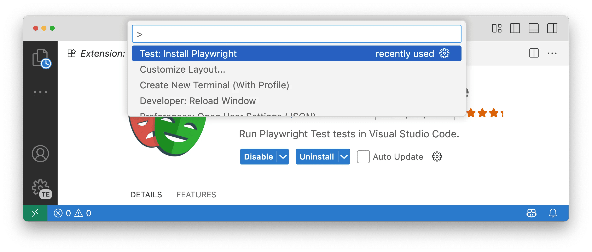
  * Select Browsers | run your tests & add a GitHub Actions workflow | run tests
    * if you want to change later -> | "playwright.config.ts"

    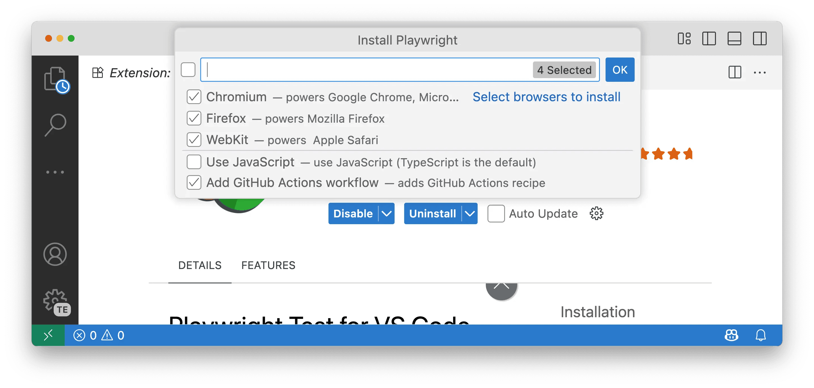

### How to open the Testing Sidebar?

* requirements
  * ⚠️open the VSC | project⚠️
    * == ❌if you open | ANOTHER path -> NOT identify tests❌

* steps
  * | VSC, click VS Code Activity Bar

* allows
  * display your tests
  * managing projects, tools, and settings

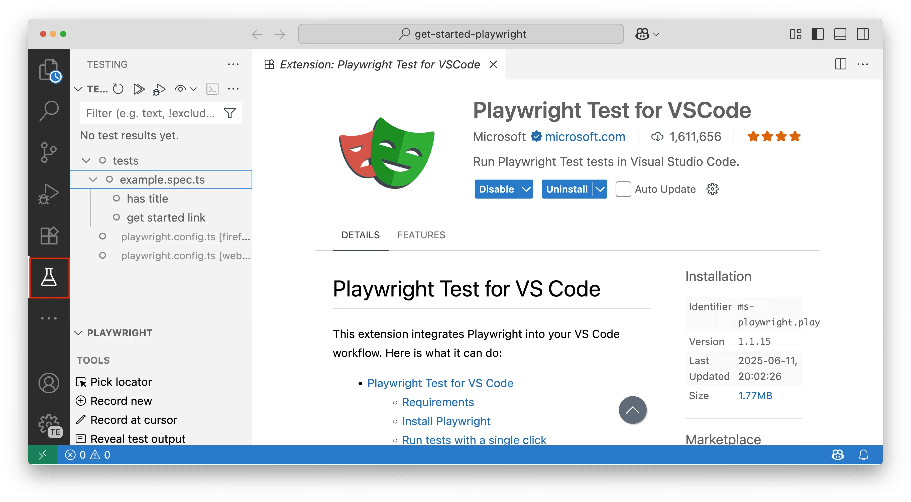

## Core Features

### Running Your Tests

* [Youtube video](https://www.youtube.com/watch?v=mQmcIBMsc38)
  * TODO:  

* how to **Run 1 Test**?
  * Click the green "play" icon | any test

  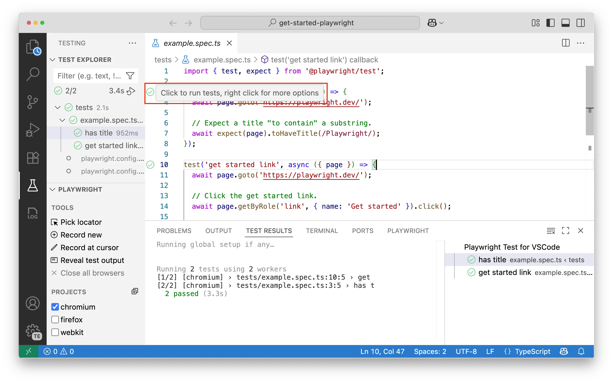

* how to **Run All Tests**?
  * run ALL tests | DIFFERENT levels

  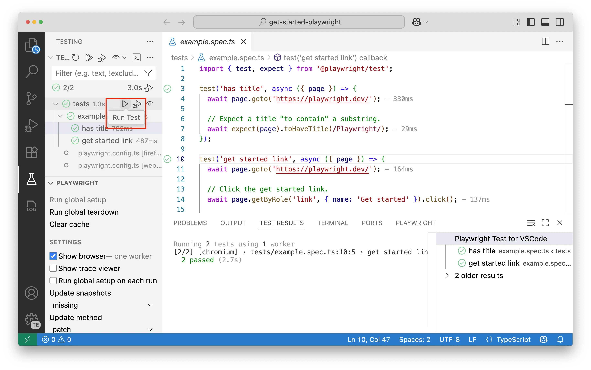

* how to **Run | Multiple Browsers**?
  * check the boxes

  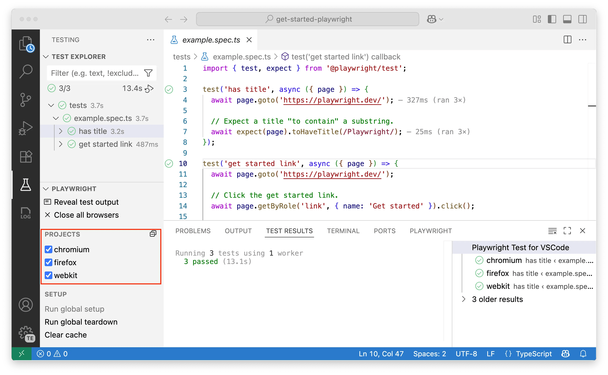

* if you want to watch your tests / executed | live browser window -> click | **Show Browser**

  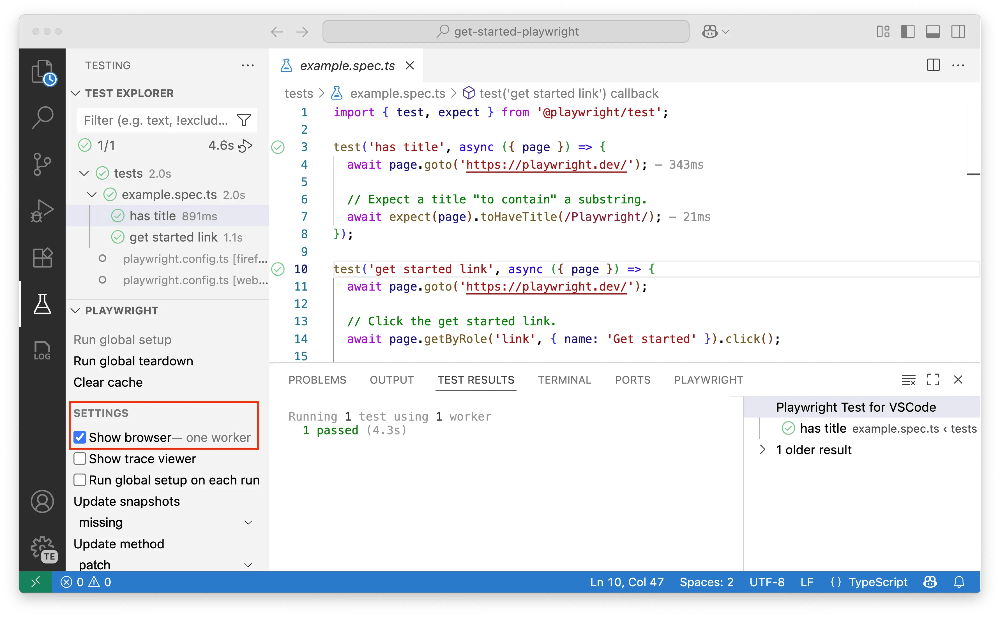

### Debugging Your Tests

* [video](https://www.youtube.com/watch?v=tJF7UhA59Gc)
  * TODO: 

* You can set breakpoints, inspect variables, view detailed error messages, get AI-powered suggestions to resolve test failures, and use the comprehensive trace viewer to analyze test execution step-by-step.

-   **Using Breakpoints**: Set a breakpoint by clicking in the gutter next to a line number
* Right-click the test and select **Debug Test**
* The test will pause at your breakpoint, allowing you to inspect variables and step through the code.

    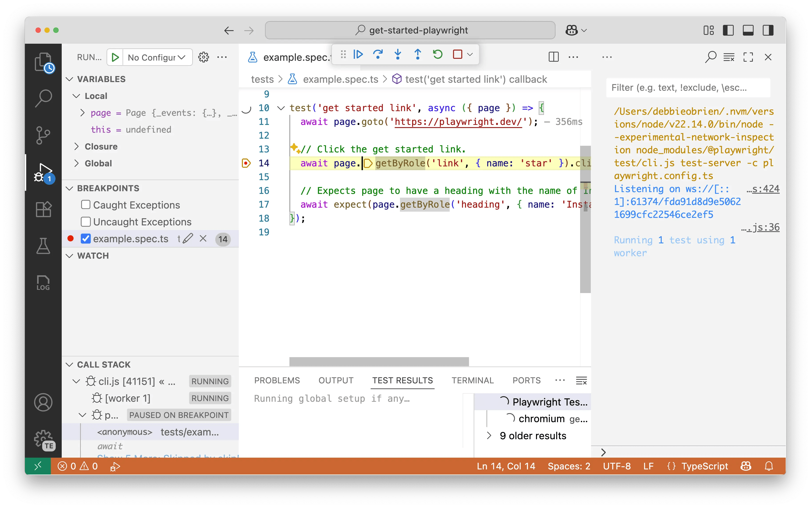

-   **Live Debugging**: With **Show Browsers** enabled, click on a locator in your code
* Playwright will highlight the corresponding element in the browser, making it easy to verify locators.

 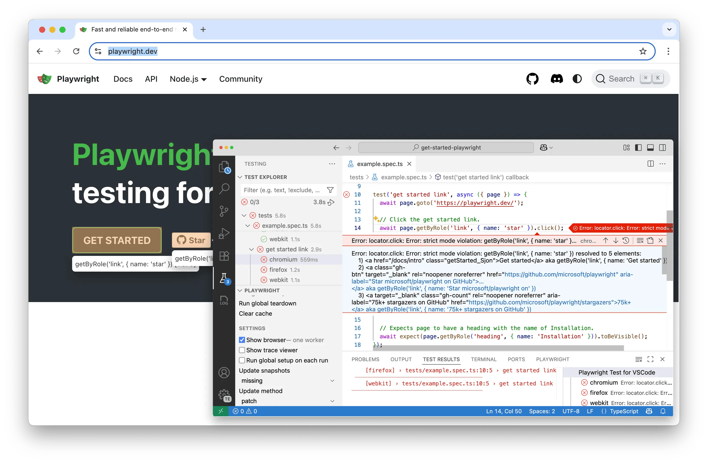

-   **Viewing Error Messages**: If a test fails, the extension displays detailed error messages, including the expected vs
* received values and a full call log, directly in the editor.

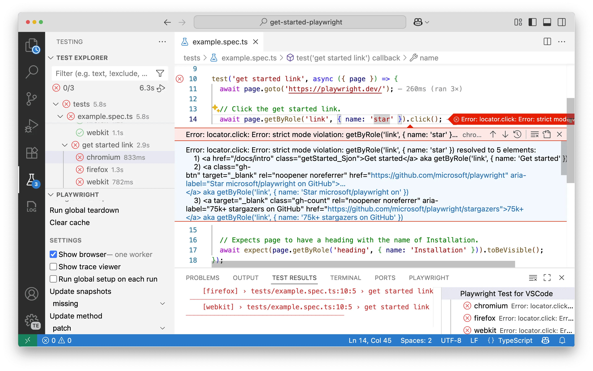

-   **Fix with AI**: When a test fails, click the sparkle icon next to the error to get an AI-powered fix suggestion from Copilot
* Copilot analyzes the error and suggests a code change to resolve the issue.

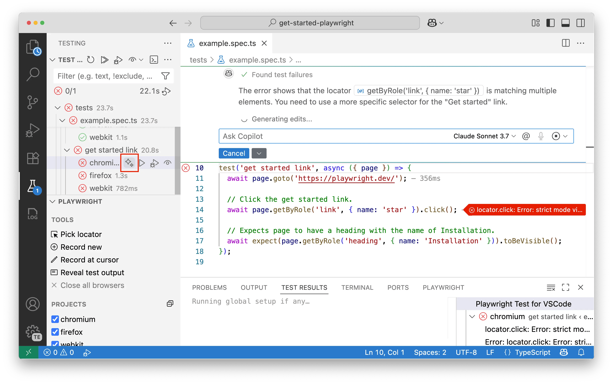

-   **Debugging with Trace Viewer**: For comprehensive debugging, enable the **Show Trace Viewer** option in the Playwright sidebar. When your test finishes, a detailed trace will automatically open, providing you with a complete timeline of your test execution. The trace viewer is particularly useful for:
    - **Step-by-step analysis**: Navigate through each action your test performed with precise timestamps
    - **DOM inspection**: View DOM snapshots at any point during test execution to see exactly what the page looked like
    - **Network monitoring**: Examine all network requests and responses that occurred during the test
    - **Console logs**: Access all console messages and errors from the browser
    - **Source mapping**: Jump directly to the source code that executed each action
    - **Visual debugging**: See screenshots and understand what the user would have seen at each step

    The trace viewer is especially valuable when debugging flaky tests or understanding complex user interactions.

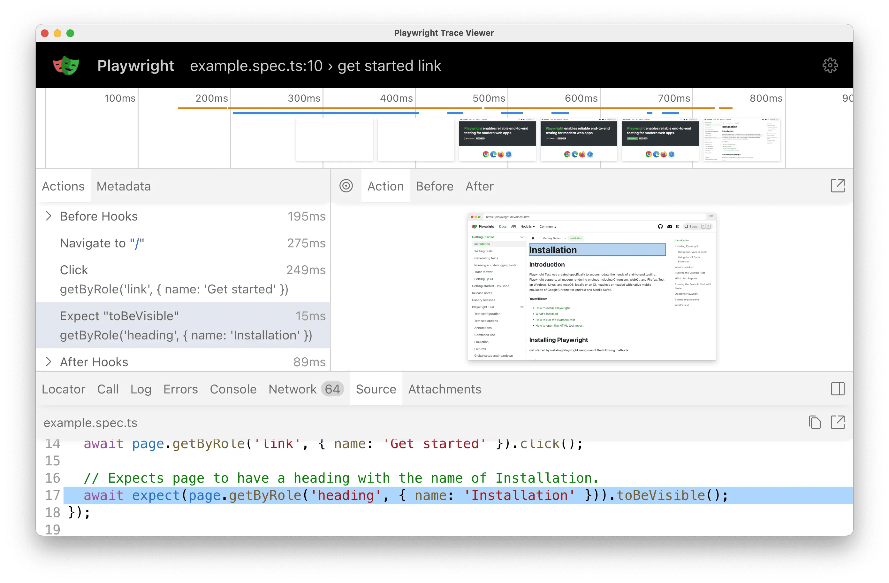

To learn more, see our [Trace Viewer guide](./trace-viewer.md).

### Generating Tests with CodeGen

CodeGen is Playwright's powerful test generation tool that automatically creates test code by recording your interactions with a web page
* Instead of writing tests from scratch, you can simply navigate through your application while CodeGen captures your actions and converts them into reliable test code with proper locators and assertions.

<LiteYouTube
    id="5XIZPqKkdBA"
    title="Generating Playwright tests in VS Code"
/>

-   **Record a New Test**: Click **Record new** in the sidebar
* A browser window will open
* As you interact with the page, Playwright will automatically generate the test code
* You can also generate assertions from the recording toolbar.

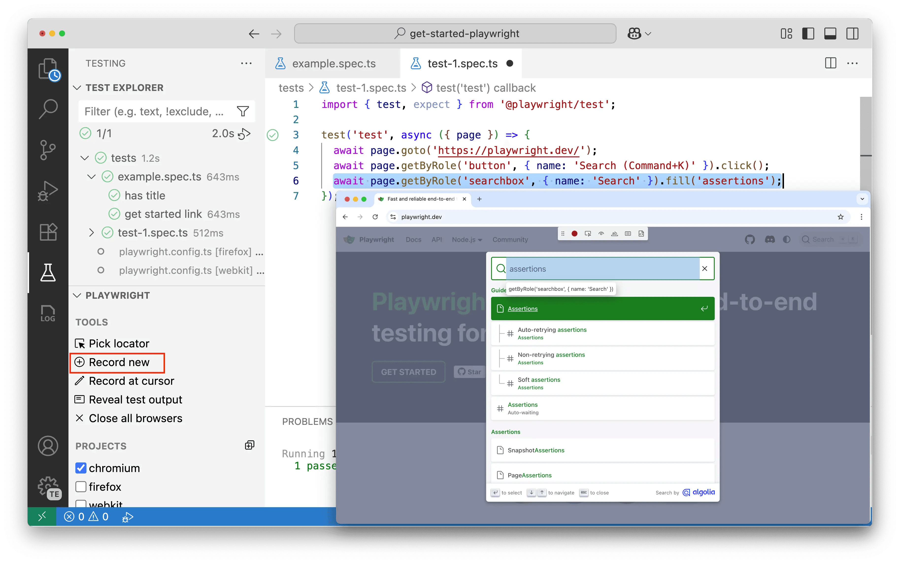

-   **Record at Cursor**: Place your cursor inside an existing test and click **Record at cursor** to add new actions at that specific point.
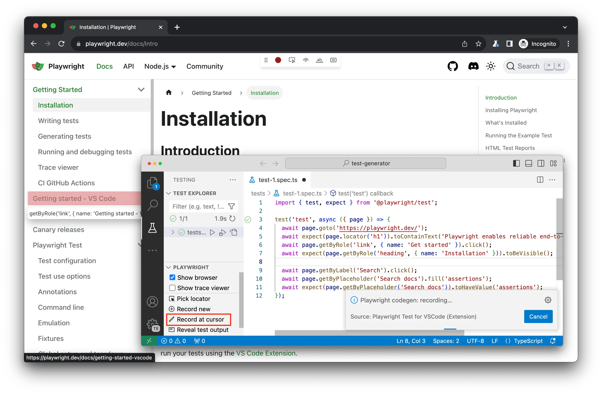

-   **Pick a Locator**: Use the **Pick locator** tool to click on any element in the opened browser
* Playwright will determine the best locator and copy it to your clipboard, ready to be pasted into your code.

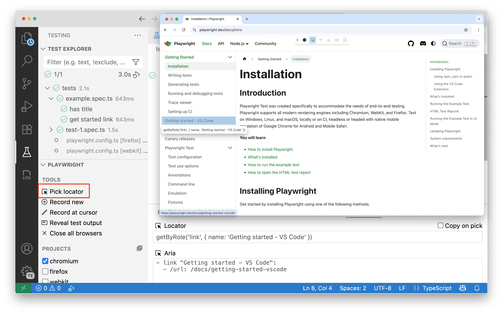

To learn more, see our [CodeGen guide](./codegen.md).

## Advanced Features

### Project Dependencies

Use [project dependencies](./test-projects.md) to define setup tests that run before other tests
* For example, you can create a login test that runs first, then reuse that authenticated state across multiple tests without having to log in again for each test
* In VS Code, you can see these setup tests in the Test Explorer and run them independently when needed.

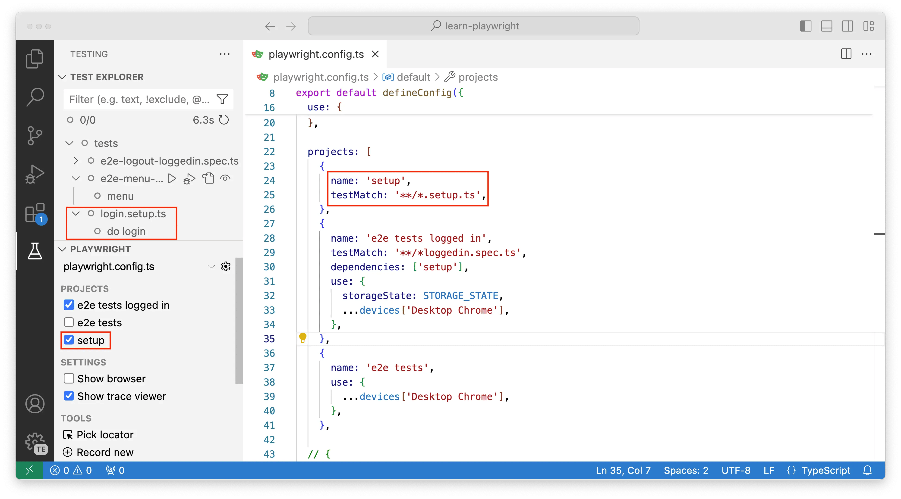

To learn more, see our [Project Dependencies guide](./test-projects.md).

### Global Setup

For tasks that need to run only once before all tests (like seeding a database), use **Global Setup**
* You can trigger the global setup and teardown manually from the Playwright sidebar.

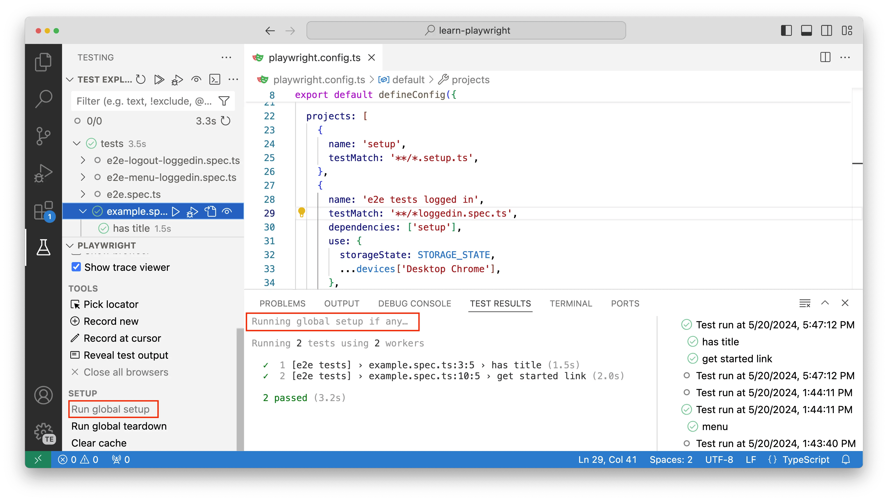

### Multiple Configurations

If you have multiple `playwright.config.ts` files, you can switch between them using the gear icon in the Playwright sidebar
* This allows you to easily work with different test suites or environments.

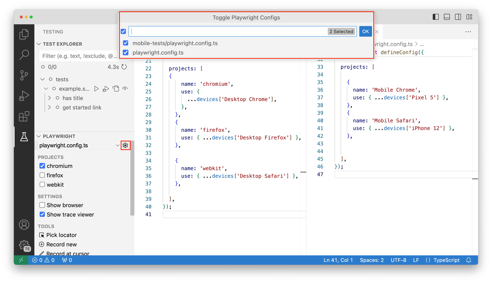

## Quick Reference

| Action                  | How to do it in VS Code                                     |
| ----------------------- | ----------------------------------------------------------- |
| **Install Playwright**  | Command Palette → `Test: Install Playwright`                |
| **Run a Test**          | Click the "play" icon next to the test                      |
| **Debug a Test**        | Set a breakpoint, right-click the test → `Debug Test`       |
| **Show Live Browser**   | Enable `Show Browsers` in the Playwright sidebar            |
| **Record a New Test**   | Click `Record new` in the Playwright sidebar                |
| **Pick a Locator**      | Click `Pick locator` in the Playwright sidebar              |
| **View Test Trace**     | Enable `Show Trace Viewer` in the Playwright sidebar        |
