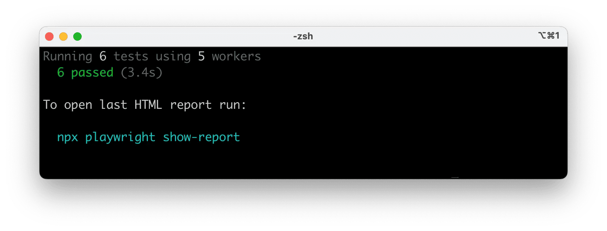
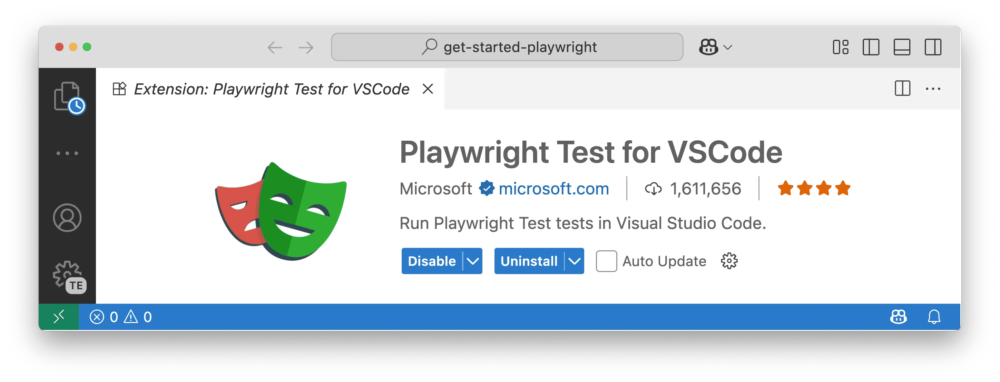
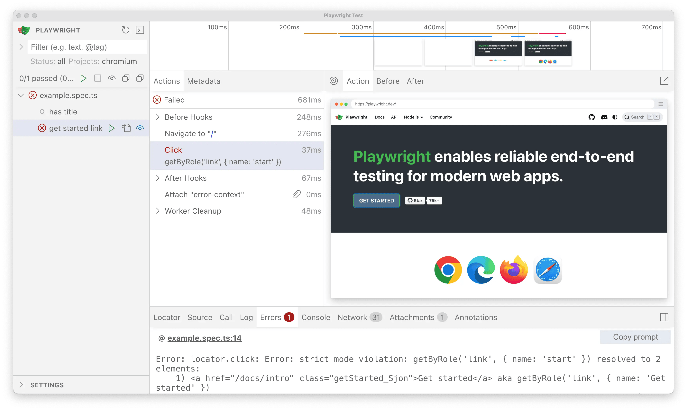
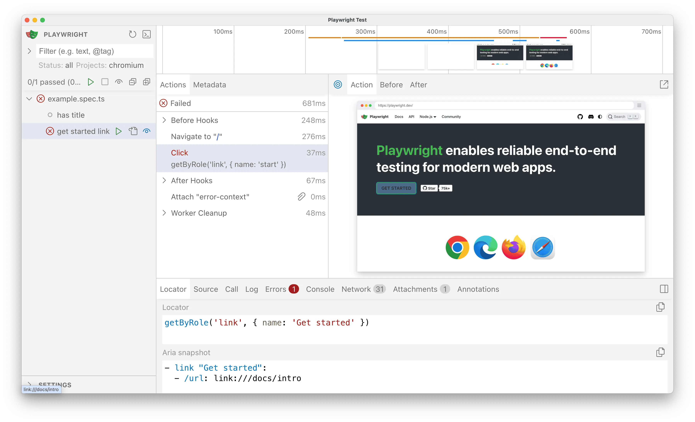
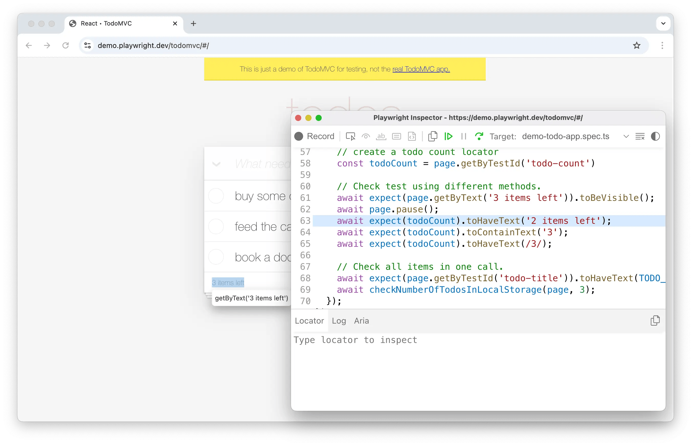
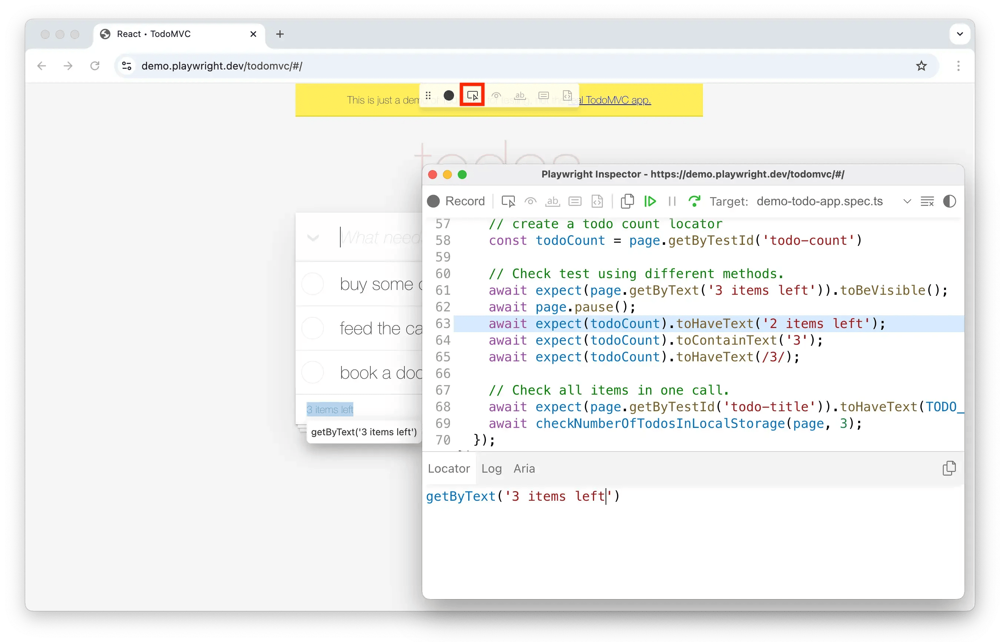
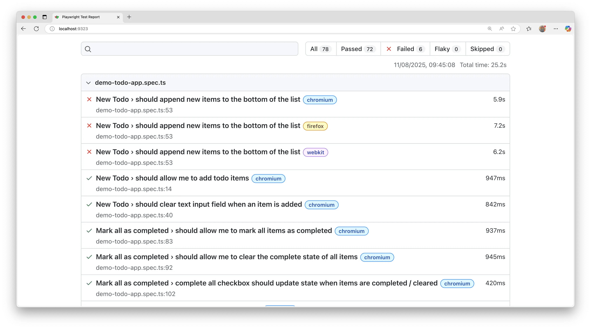
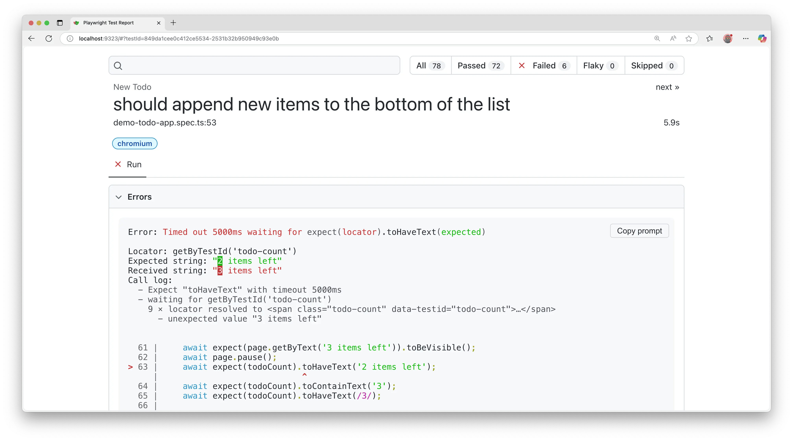

## Running tests

* by default,
  * [parallelism -- BETWEEN -- files](test-parallel-js.md)
  * [headless](#-headed-mode------headed---)
  * [MINIMUM(1/2 * CPU cores, NUMBER of tests)](test-api/class-testconfig.md#property-testconfigworkers)
  * [0 retries](test-retries-js.md)
  * [list reporter](test-reporters-js.md)
  * TODO: timeouts ([timeouts](./test-timeouts.md))
    * test -> 30_000 ms
    * expect -> 5_000 ms
    * action / navigation -> 0 (no timeout)
  * screenshot / video / trace -> OFF ([use options](./test-use-options.md))

### CL

* ways
  * `npx playwright test`
  * `yarn playwright test`
  * `pnpm exec playwright test`



### | UI mode

* [here](test-ui-mode-js.md)


### | headed mode -- `--headed` --

* ways to specify
  * `npx playwright test --headed`
  * `.launch({ headless: false });`

* by default,
  * tests run browsers | headless mode
    * == ❌NO browser opened up ❌
    * == tests' results & test logs | terminal

* provides
  * visually see how Playwright interacts -- with -- the website

### | DIFFERENT browsers -- `--project <BROWSER_NAME>` --

* if you want to run tests | MULTIPLE browsers -> `--project <BROWSER_NAME_1> --project <BROWSER_NAME_2> ...`

### specific tests

```bash
npx playwright test <TEST_FILE_NAME>
npx playwright test <KEYWORD_MATCHING_TEST_FILE_NAME>
npx playwright test -g "<TEST_TITLE_NAME>"
```

```bash
npx playwright test tests/<FOLDER_NAME>
```

### | last failed tests

TODO:
To run only the tests that failed in the last test run, first run your tests and then run them again with the `--last-failed` flag.

```bash
npx playwright test --last-failed
```

Playwright stores the list of failed tests from the previous run in `<outputDir>/.last-run.json` (see [`property: TestConfig.outputDir`](./test-configuration.md))
* To use a different file path, pass `--last-failed-file=<path>` or set `PLAYWRIGHT_LAST_RUN_OUTPUT_FILE`.

```bash
npx playwright test --last-failed --last-failed-file=.cache/last-run-shard-1.json
```

### Run tests in VS Code

Tests can be run right from VS Code using the [VS Code extension](https://marketplace.visualstudio.com/items?itemName=ms-playwright.playwright)
* Once installed you can simply click the green triangle next to the test you want to run or run all tests from the testing sidebar
* Check out our [Getting Started with VS Code](./getting-started-vscode.md) guide for more details.



## Debugging tests

Since Playwright runs in Node.js, you can debug it with your debugger of choice, e.g. using `console.log`, inside your IDE, or directly in VS Code with the [VS Code Extension](./getting-started-vscode.md)
* Playwright comes with [UI Mode](./test-ui-mode.md), where you can easily walk through each step of the test, see logs, errors, network requests, inspect the DOM snapshot, and more
* You can also use the [Playwright Inspector](./debug.md#playwright-inspector), which allows you to step through Playwright API calls, see their debug logs, and explore [locators](./locators.md).

### Debug tests in UI mode

We highly recommend debugging your tests with [UI Mode](./test-ui-mode.md) for a better developer experience where you can easily walk through each step of the test and visually see what was happening before, during, and after each step
* UI mode also comes with many other features such as the locator picker, watch mode, and more.

```bash
npx playwright test --ui
```



While debugging you can use the Pick Locator button to select an element on the page and see the locator that Playwright would use to find that element
* You can also edit the locator in the locator playground and see it highlighting live in the browser window
* Use the Copy Locator button to copy the locator to your clipboard and then paste it into your test.



Check out our [detailed guide on UI Mode](./test-ui-mode.md) to learn more about its features.

### Debug tests with the Playwright Inspector

To debug all tests, run the Playwright test command followed by the `--debug` flag.

```bash
npx playwright test --debug
```



This command opens a browser window as well as the Playwright Inspector
* You can use the step over button at the top of the inspector to step through your test
* Or, press the play button to run your test from start to finish
* Once the test finishes, the browser window closes.

To debug one test file, run the Playwright test command with the test file name that you want to debug followed by the `--debug` flag.

```bash
npx playwright test example.spec.ts --debug
```

To debug a specific test from the line number where the `test(..` is defined, add a colon followed by the line number at the end of the test file name, followed by the `--debug` flag.

```bash
npx playwright test example.spec.ts:10 --debug
```

While debugging you can use the Pick Locator button to select an element on the page and see the locator that Playwright would use to find that element
* You can also edit the locator and see it highlighting live in the browser window
* Use the Copy Locator button to copy the locator to your clipboard and then paste it into your test.




Check out our [debugging guide](./debug.md) to learn more about debugging with the [VS Code debugger](./debug.md#vs-code-debugger), UI Mode, and the [Playwright Inspector](./debug.md#playwright-inspector) as well as debugging with [Browser Developer tools](./debug.md#browser-developer-tools).


## Test reports

The [HTML Reporter](./test-reporters.md#html-reporter) shows you a full report of your tests allowing you to filter the report by browsers, passed tests, failed tests, skipped tests, and flaky tests
* By default, the HTML report opens automatically if some tests failed, otherwise you can open it with the following command.

```bash
npx playwright show-report
```



You can filter and search for tests as well as click on each test to see the test errors and explore each step of the test.




## What's next

- [Generate tests with Codegen](../Generating%20tests/codegen-intro.md)
- [See a trace of your tests](./trace-viewer-intro.md)
- [Explore all the features of UI Mode](./test-ui-mode.md)
- [Run your tests on CI with GitHub Actions](../CI%20GitHub%20Actions/ci-intro.md)
